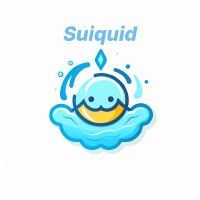
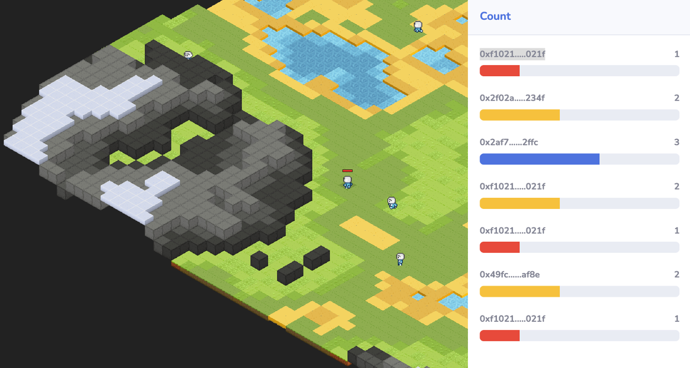
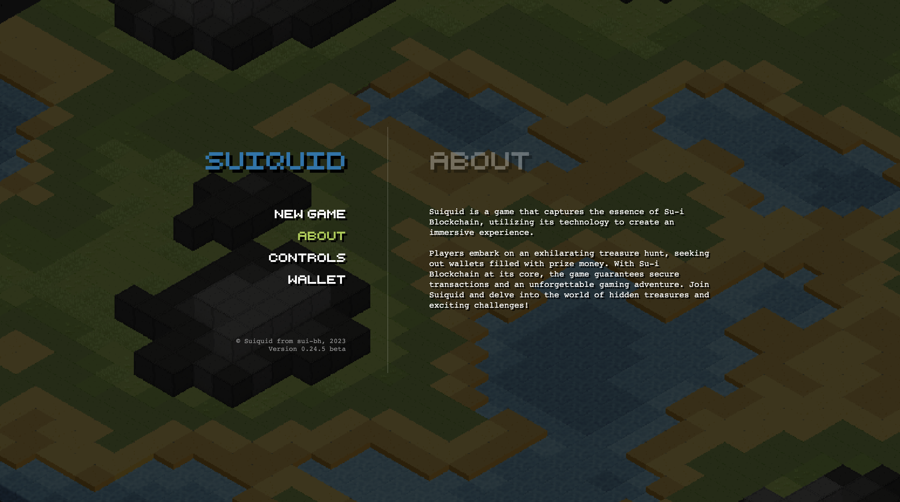
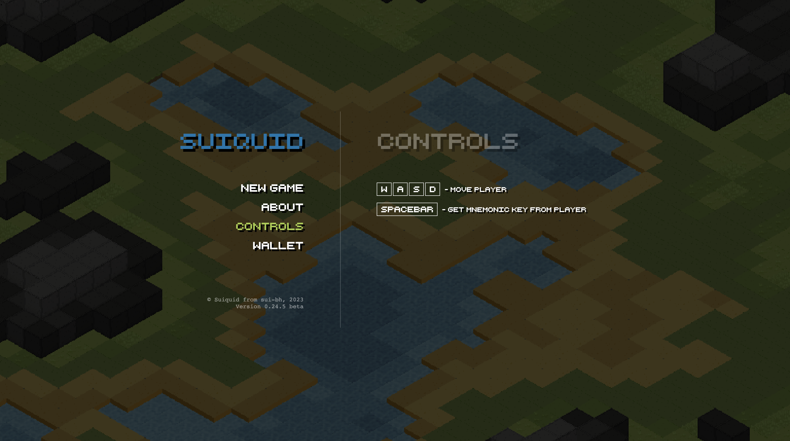
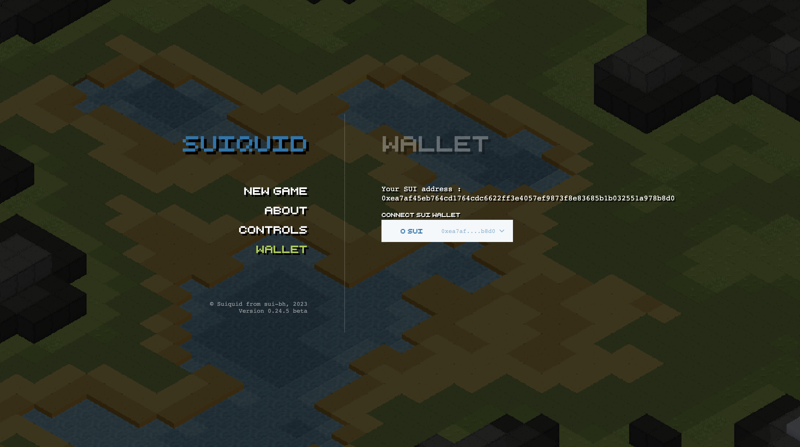

## SUIQUID

.

__Install:__

* `git clone https://github.com/suisquid/game.git`
* `npm install`
* `npm start`

.
__INGAME:__

  

  

  

  

.

__About:__ 

**SuiQuid** is a blockchain-based game inspired by the thrilling concept of the Netflix Original "Squid Game" series. It has a competitive hide-and-seek gameplay model where 12 players compete for a prize. 

### Gameplay
In SuiQuid, each game is set in a desert island. Players need to tag others faster and run away from others at the same time. The player dies immediately upon being tagged. The game ends when only one player is left, who is then declared the winner. The objective for seeker is to find and capture all the hiders within a specified time limit.
### Ecosystem
The prize pool, funded by advertisers, is awarded to the winner of each game. The winner takes the entire prize. A portion of the advertisement revenue in SuiQuid is allocated to game development, maintenance, and further prize pool funding. The remaining revenue is distributed to the team fostering the sustainability.
 
.

__Stack:__ 

* `React`, `Sui`